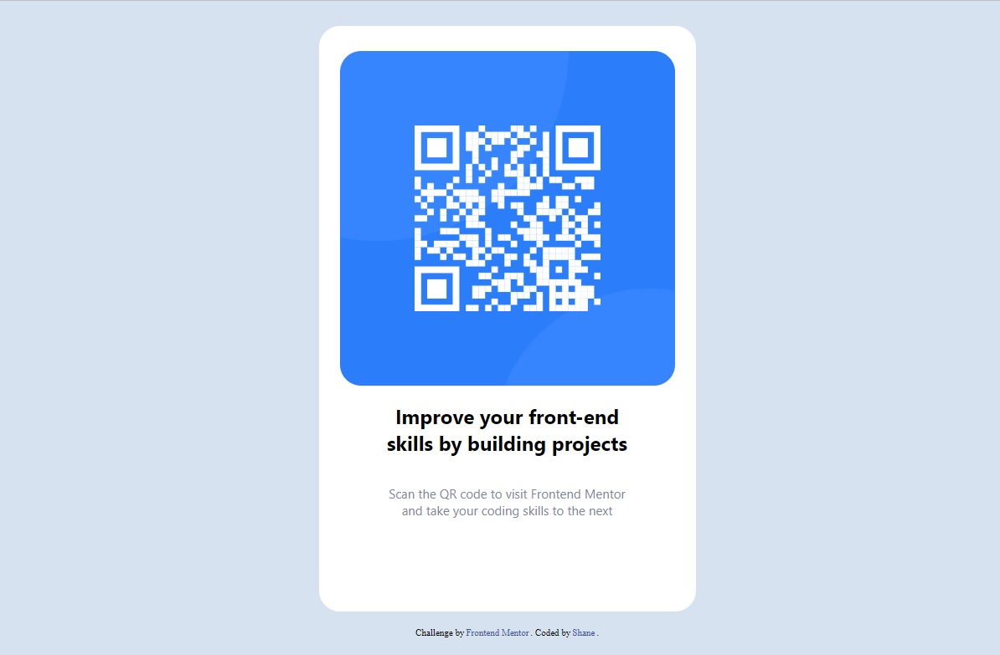

# Frontend Mentor - QR code component solution

This is a solution to the [QR code component challenge on Frontend Mentor](https://www.frontendmentor.io/challenges/qr-code-component-iux_sIO_H). Frontend Mentor challenges help you improve your coding skills by building realistic projects. 

## Table of contents

- [Overview](#overview)
  - [Screenshot](#screenshot)
  - [Links](#links)
- [My process](#my-process)
  - [Built with](#built-with)
  - [What I learned](#what-i-learned)
  - [Continued development](#continued-development)
- [Author](#author)

**Note: Delete this note and update the table of contents based on what sections you keep.**

## Overview

### Screenshot

### Links

- Solution URL: [My Github Repo](https://github.com/splwdev/QR-Code-Component)
- Live Site URL: [Published Github Pages Version](https://splwdev.github.io/QR-Code-Component)

## My process

### Built with

- Semantic HTML5 markup
- CSS custom properties
- Flexbox

### What I learned

Being in the 2nd week of learning for my Web Developer journey (only learnt about Flexbox today), I've definitely realised building a site from scratch does take a lot of thinking about, espcially at my level.

### Continued development

Only on the first day of my 2nd week of a baseline course on web development, but I do realise that this is a never ending learning journey. I'm intending to consolidate the knowledge I've learnt so far (hence I've started using this site) and am looking forward to improving my skills as I continue on this journey.

## Author

- Frontend Mentor - [@splwdev](https://www.frontendmentor.io/profile/splwdev)
